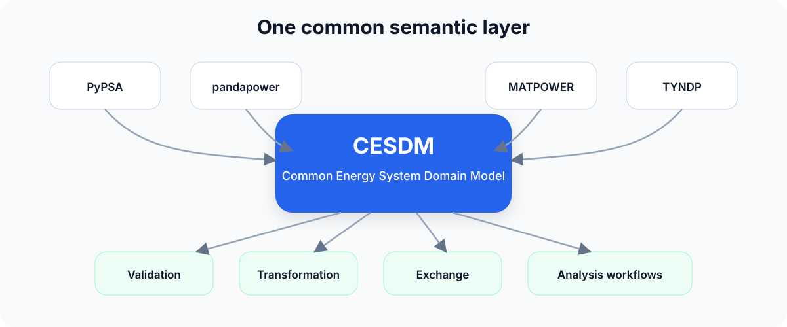
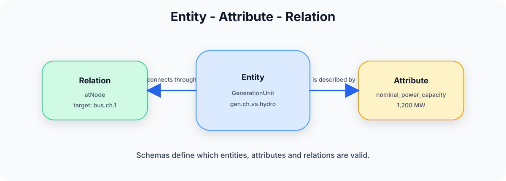

<p align="center">
  
</p>

<p align="center">
  <a href="https://cesdm.github.io/cesdm-toolbox/"></a>
  <a href="LICENSE"></a>
  
</p>

<p align="center">
  <strong>A schema-driven, tool-independent semantic framework for interoperable energy-system modelling.</strong>
</p>

<p align="center">
  Build once · Validate once · Exchange everywhere
</p>

---

## Why CESDM?

Energy-system studies often combine several specialised tools, each with its own data structures, terminology, and assumptions. Moving models between them usually requires custom conversion logic and repeated interpretation of the same physical system.

**CESDM provides a common semantic representation between data sources, modelling tools, and analysis workflows.**

| Principle | What it means |
|---|---|
| **Tool independent** | Describe the system independently of a particular solver or simulation package. |
| **Schema driven** | Define entity classes, attributes, relations, and validation rules in YAML. |
| **Interoperable** | Import, validate, transform, and exchange models across different tools and formats. |
| **Extensible** | Add domain-specific entities and relations without rewriting the generic EAR engine. |

<p align="center">
  
</p>

---

## Core idea

CESDM applies the generic **Entity–Attribute–Relation (EAR)** paradigm to energy systems.

- An **entity** is an object, such as a generation unit, electrical bus, demand unit, or transmission line.
- An **attribute** is a property of an entity, such as `nominal_voltage` or `nominal_power_capacity`.
- A **relation** connects entities, such as `atNode`, `fromNode`, or `hasTechnology`.

Energy-specific semantics live in YAML schemas; the EAR engine itself remains domain independent. Day-to-day Python modelling usually uses the **[Proxy API](docs/guides/proxy-api.md)** (`bus.name = …`, `gen.atNode = bus`); the Core EAR API (`add_attribute` / `add_relation`) is always available underneath.

<p align="center">
  
</p>

---

## Installation

```bash
git clone https://github.com/cesdm/cesdm-toolbox.git
cd cesdm-toolbox

python -m venv .venv
source .venv/bin/activate          # Windows: .venv\Scripts\activate

python -m pip install --upgrade pip setuptools wheel
pip install -e .
```

<details>
<summary>Using <a href="https://docs.astral.sh/uv/">uv</a> or Poetry instead</summary>

```bash
# uv
uv venv
source .venv/bin/activate   # Windows: .venv\Scripts\activate
uv pip install -e .

# Poetry
poetry install
poetry shell
```

</details>

| Optional component | Command |
|---|---|
| PyPSA | `pip install -e ".[pypsa]"` |
| pandapower | `pip install -e ".[pandapower]"` |
| MATPOWER | `pip install -e ".[matpower]"` |
| Jupyter notebook tutorial | `pip install -e ".[jupyter]"` |
| Development tools | `pip install -e ".[dev]"` |
| Everything (toolbox extras) | `pip install -e ".[all]"` |
| FlexECO (in-house, **separate** package) | `pip install -e /path/to/cesdm-flexeco` — see [Tool adapters](docs/guides/tool-adapters.md) |

External TYNDP / PyPSA sample data (large): `cesdm-download-data` → writes under `external_data/`.

---

## Quick start

Preferred path — run the canonical intro scripts from the repository root:

```bash
# 1) Minimal electricity model (~1 bus, wind/PV/hydro, demand + profiles)
python docs/examples/minimal_electricity_model.py

# 2) Full CH + neighbours reference (fleet, hydro, NTCs, energy balance)
python docs/examples/reference_energy_system_model.py
```

Outputs land in `output/minimal_electricity_model/` and `output/reference_energy_system_model/` (YAML, Frictionless, `profiles.h5`).

Walkthroughs: **[Quickstart](docs/getting-started/quickstart.md)** → **[Your First Model](docs/getting-started/first-model-simple.md)** → **[Building your CESDM Model](docs/tutorials/building-first-model/overview.md)** (Parts 1–4 + [notebook](notebooks/building_your_cesdm_model.ipynb)).

<details>
<summary>Minimal Core EAR snippet (same API the reference script uses)</summary>

```python
from cesdm_toolbox import build_model_from_yaml
from cesdm.default_library import GeneratorTypes

model = build_model_from_yaml("schemas/cesdm")
model.import_library("library/default_library")

model.add_entity("EnergySystemModel", "demo")
bus = model.add_entity("ElectricalBus", "bus.1")
bus.add_attribute("nominal_voltage", 380, unit="kV")

gen = model.add_entity("GenerationUnit", "gen.gas.1")
gen.add_attribute("nominal_power_capacity", 400, unit="MW")
gen.add_relation("atNode", "bus.1")
gen.add_relation("hasTechnology", GeneratorTypes.GENERATION_THERMAL_GAS_CCGT_NEW)

model.validate_or_raise()
print(model.summary())
```

</details>

---

## What CESDM provides

- Schema-driven construction and validation (EAR + Proxy API)
- Reusable libraries: `library/default_library/` and optional `library/tyndp_library/`
- Exchange formats: YAML, Frictionless, HDF5 profiles, CSV/Excel, …
- Public tool adapters: PyPSA, pandapower, MATPOWER; TYNDP data import
- Analysis validation profiles (`cesdm` / `tools/validate_analysis.py`)
- Schema extensions (e.g. agent-based) without rewriting the EAR engine

In-house solvers (e.g. FlexECO) live in **separate adapter packages**, not in this toolbox core.

---

## Import and export

| Interface | In this toolbox |
|---|---|
| YAML / Frictionless / HDF5 profiles | Core exchange |
| PyPSA | Import (`tools/import_pypsa.py`) |
| TYNDP | Import (`examples/example_import_tyndp*.py`) |
| pandapower / MATPOWER | Import and export |
| FlexECO | Separate package [`cesdm-flexeco`](docs/guides/tool-adapters.md) |

---

## Examples

| Script | Role |
|---|---|
| [`docs/examples/minimal_electricity_model.py`](docs/examples/minimal_electricity_model.py) | **Intro 1** — smallest useful study model |
| [`docs/examples/reference_energy_system_model.py`](docs/examples/reference_energy_system_model.py) | **Intro 2** — CH + DE/FR/IT/AT reference |
| [`notebooks/building_your_cesdm_model.ipynb`](notebooks/building_your_cesdm_model.ipynb) | Interactive Proxy walkthrough of the reference |
| [`examples/`](examples/) | Further: PyPSA/TYNDP import, hydro plant, multi-energy, … |

---

## Documentation

| Topic | Link |
|---|---|
| Choose your path | [docs/getting-started/choose-your-path.md](docs/getting-started/choose-your-path.md) |
| What is CESDM? | [docs/getting-started/what-is-cesdm.md](docs/getting-started/what-is-cesdm.md) |
| Core concepts | [docs/getting-started/core-concepts.md](docs/getting-started/core-concepts.md) |
| Libraries | [docs/guides/libraries.md](docs/guides/libraries.md) |
| Tool adapters | [docs/guides/tool-adapters.md](docs/guides/tool-adapters.md) |
| Profiles | [docs/guides/profiles.md](docs/guides/profiles.md) |
| FAQ · Glossary | [faq](docs/community/faq.md) · [glossary](docs/community/glossary.md) |

Full site: **[cesdm.github.io/cesdm-toolbox](https://cesdm.github.io/cesdm-toolbox/)**

---

## Repository structure

```text
.
├── ear/                      # Generic EAR engine
├── cesdm/                    # Energy-system domain layer
├── schemas/cesdm/            # YAML schemas
├── library/
│   ├── default_library/      # Carriers, GeneratorTypes, …
│   └── tyndp_library/        # Optional TYNDP vintage technologies
├── tools/                    # CLI utilities, public importers/exporters
├── docs/
│   ├── examples/             # Canonical intro scripts
│   ├── getting-started/      # Quickstart & concepts
│   ├── tutorials/            # Building-your-model Parts 1–4
│   └── guides/               # Proxy API, libraries, adapters, …
├── notebooks/                # Interactive reference tutorial
├── examples/                 # Further runnable examples
├── analysis_profiles/        # power_flow, optimal_dispatch, …
└── typings/                  # Generated editor stubs
```

---

## Project status

CESDM is a **research prototype** (SWEET-CoSi). Schemas and APIs evolve; treat releases as methodology demonstrators unless pinned.

---

## Contributing

Schema changes, adapters, validation profiles, examples, and docs are welcome. Open an issue before large structural changes. See [`CONTRIBUTING.md`](CONTRIBUTING.md).

---

## License

See [`LICENSE`](LICENSE).
