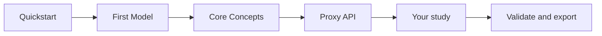

# Choose Your Path

CESDM documentation is organised around what you want to accomplish. **Lost?** Use the [documentation map](#documentation-map) below. **Ready to build?** Start with the [Quickstart](quickstart.md).

!!! abstract "Concepts tab — essential vs on demand"
    **Essential (~45 min):** [What is CESDM?](what-is-cesdm.md) → [Core Concepts](core-concepts.md) → [Schemas](schemas.md) → [Validation](validation.md) → [Proxy API](../guides/proxy-api.md) → [Libraries](../guides/libraries.md) — then [Building Models](../guides/modelling-workflow.md).  
    Full guide: [Concepts overview](concepts.md).

!!! tip "Default Modelling path"
    [Quickstart](quickstart.md) (~20 min) → [Your First Model (Simple)](first-model-simple.md) (~10 min) → [Core Concepts](core-concepts.md) → [Schemas](schemas.md) → [Validation](validation.md) → [Proxy API](../guides/proxy-api.md) → [Libraries](../guides/libraries.md)

---

## Energy system modeller

*You study energy systems and want a shared, tool-independent model of the physical system.*

| Step | Page | Why |
|------|------|-----|
| 1 | [Quickstart](quickstart.md) | Install, run script, confirm exports (~20 min) |
| 2 | [Your First Model (Simple)](first-model-simple.md) | Understand the script — Core + Proxy API (~10 min) |
| 3 | [What is CESDM?](what-is-cesdm.md) | Why harmonised exchange and comparison matter |
| 4 | [Core Concepts](core-concepts.md) | Entities, attributes, relations |
| 5 | [Schemas](schemas.md) | Vocabulary layer |
| 6 | [Validation](validation.md) | Schema and analysis-specific checks |
| 7 | [Proxy API](../guides/proxy-api.md) | Day-to-day Python access |
| 8 | [Libraries](../guides/libraries.md) | Import shared reference entities |
| 9 | [Modelling Workflow](../guides/modelling-workflow.md) | Build → validate → export lifecycle |
| 10 | [Building your CESDM Model](../tutorials/building-first-model/overview.md) | Full multi-domain reference (~45 min, optional) |
| 11 | [Conversion Units](../tutorials/conversion-units/overview.md) | Heat pump, electrolyser, boiler, fuel cell, CHP (~30 min) |
| 12 | [Modeller cheat sheet](modeller-cheat-sheet.md) | Quick patterns while modelling |

**Typical questions:** *How do I add a wind farm?* → [Cheat sheet](modeller-cheat-sheet.md) + [Proxy API](../community/glossary.md#proxy-api). *Load profile?* → [Profiles](../guides/profiles.md). *Ready for power flow?* → [Validation — analysis-specific](validation.md#analysis-specific-validation).

---

## Tool developer

*You integrate CESDM into analysis software or data pipelines.*

| Step | Page |
|------|------|
| 1 | [Schemas](schemas.md) |
| 2 | [Schema Augmentation](schemas-in-depth.md) |
| 3 | [EAR API Reference](../reference/api-reference.md) |

---

## Curious reader

*Understand CESDM before installing anything.*

| Step | Page |
|------|------|
| 1 | [Welcome](../index.md) |
| 2 | [What is CESDM?](what-is-cesdm.md) |
| 3 | [Core Concepts](core-concepts.md) |
| 4 | [FAQ](../community/faq.md) |

No Python required.

---

## Visual overview

Optional: [Building your CESDM Model](../tutorials/building-first-model/overview.md) after you are comfortable with the simple model.

---

## Documentation map

How the site is organised by tab.

### Home

| Page | Content |
|------|---------|
| [Welcome](../index.md) | What / Why / Architecture — links to Quickstart |

### Getting Started (~30 min core path)

| Page | Time |
|------|------|
| [Quickstart](quickstart.md) | ~20 min — install, run script, confirm exports |
| [Your First Model (Simple)](first-model-simple.md) | ~10 min — walk through the script |
| [Installation](installation.md) | Full install (uv, Poetry, Conda, extras) |
| [Choose Your Path](choose-your-path.md) | This page — roles and site map |

### Concepts (~45 min essential)

| Page | When |
|------|------|
| [Concepts overview](concepts.md) | How this tab fits together |
| [What is CESDM?](what-is-cesdm.md) | Motivation and scope (~15 min) |
| [Core Concepts (EAR)](core-concepts.md) | Entities, attributes, relations (~10 min) |
| [Schemas](schemas.md) | Vocabulary layer — or [CESDM Schema Reference](../reference/schema-reference.md) for lookup |
| [Validation](validation.md) | Schema and analysis-specific checks |
| [Proxy API](../guides/proxy-api.md) | Day-to-day Python modelling (~10 min) |
| [Libraries](../guides/libraries.md) | Import the default library — carriers, technologies, resources |
| [Carrier Domains](../guides/carrier-domains.md) | Multi-carrier systems |

### Building Models

| Page | Content |
|------|---------|
| [Modelling Workflow](../guides/modelling-workflow.md) | Build → validate → export lifecycle |
| [Modeller cheat sheet](modeller-cheat-sheet.md) | Quick patterns while building |
| [Profiles & Time-series](../guides/profiles.md) | Time-dependent data |
| [Building your CESDM Model](../tutorials/building-first-model/overview.md) | Notebook or parts — full reference model |
| [Spatial Aggregation (optional)](../guides/spatial-aggregation.md) | Coarser spatial models |

### Building Applications

| Page | Content |
|------|---------|
| [Schema Augmentation](schemas-in-depth.md) | Extend the schema vocabulary |
| [EAR API Reference](../reference/api-reference.md) | Low-level `ear` engine API |

### Reference

| Page | Use when |
|------|----------|
| **[CESDM Schema Reference](../reference/schema-reference.html)** | Look up entity classes, attributes, relations (interactive) |
| [Modeller Cheat Sheet](modeller-cheat-sheet.md) | Quick patterns while building |
| [Glossary](../community/glossary.md) | Shared terms |
| [EAR API Reference](../reference/api-reference.md) | Low-level `ear` engine (integrators) |
| [Python Typings & Proxies (optional)](../guides/python-typing-proxies.md) | IDE autocomplete and type checking for the Proxy API |

### Community

[FAQ](../community/faq.md) · [Glossary](../community/glossary.md) · [Contributing](../community/contributing.md) · [About](about.md) · [Disclaimer](disclaimer.md)

---

→ [Quickstart](quickstart.md)
