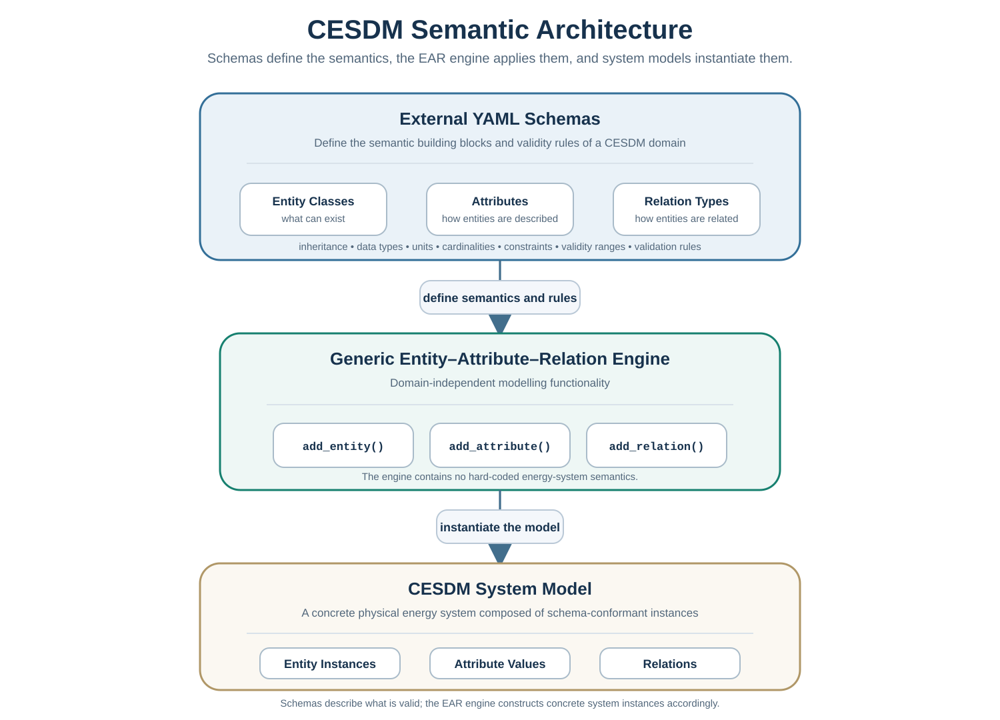

# Core Concepts

The previous chapters introduced **why CESDM is needed** and **what CESDM is**.

This chapter explains **how CESDM represents an energy system** — in terms a energy system modeller can use immediately, without reading the full schema reference first. Terms marked with links point to the [Glossary](../community/glossary.md).

!!! abstract "Before you continue"
    **Recommended:** Complete the [Quickstart](quickstart.md) or [Your First Model (Simple)](first-model-simple.md) tutorial first so you have already created entities in practice. This page names what you were doing.

---

## Three building blocks: Entity, Attribute, Relation

Every CESDM model is built from three concepts. You use them whether you write Python or inspect an exported [YAML](../community/glossary.md#yaml) file.

```text
Schemas — vocabulary & rules         System model — instances you build
────────────────────────────         ───────────────────────────────────
Entity class: GenerationUnit   →     Instance: gen.ch.wind

  Attributes defined on class          Values assigned on instance
    name (string)                          name = "Swiss wind farm"
    nominal_power_capacity (MW)            nominal_power_capacity = 3500 MW

  Relations defined on class             Targets assigned on instance
    atNode → ElectricalBus                 atNode → bus.ch
    hasTechnology → EnergyTechnology       hasTechnology → library type
```

### Entity class vs entity instance

This is the key distinction for day-to-day modelling:

| Concept | Example | What it is | Who creates it |
|---------|---------|------------|----------------|
| **Entity class** | `GenerationUnit` | The *type* — what kind of thing this is | Defined in **schemas** (CESDM core, optionally extended) |
| **Entity instance** | `gen.ch.wind` | A *concrete object* in your study | **You**, the modeller, in your system model |

In normal workflow you **create instances** of existing classes — you do not invent a new class for every wind farm. You call `add_entity(entity_class='GenerationUnit', entity_id='gen.ch.wind')`.

Schemas define which **entity classes** exist and **which attributes and relations belong to each class**. The **CESDM core schemas** provide the standard vocabulary (`GenerationUnit`, `ElectricalBus`, …). When a study needs additional semantics, projects **extend** schemas through [Schema Augmentation](schemas-in-depth.md) — in YAML, without touching the Python engine. Many studies use core as given and focus on building instances; others augment the vocabulary first.

### Schema definition vs values on instances

For **attributes** and **relations**, CESDM separates two steps that are easy to conflate:

| Step | Where it lives | Question it answers | Who does it |
|------|----------------|---------------------|-------------|
| **Define** attributes and relations and **map them to entity classes** | **Schemas** | *Which properties and relations may exist on `GenerationUnit`, `ElectricalBus`, …?* | Schema authors (CESDM core; optionally your project) |
| **Assign** attribute values and relation targets | **Your system model** | *What are the capacity, name, and bus connection of **this** wind farm?* | **You**, the modeller |

**In the schema**, an attribute is a *slot* — an identifier with a declared type, unit, and rules (for example `nominal_power_capacity` in MW on `GenerationUnit`). A relation is a *slot* too — a named link with allowed source and target classes (for example `atNode` from a unit to an `ElectricalBus`).

**In your model**, you do not redefine those slots. You **fill** them on each **entity instance**:

1. **Create** the instance (`add_entity`) — choose class and unique ID.
2. **Assign attribute values** (`add_attribute` or Proxy assignment) — concrete numbers, text, profiles.
3. **Assign relation targets** (`add_relation` or Proxy assignment) — point to other entity instances (`bus.ch`, `region.country.CH`, …).

If a value or link is not declared for that class in the loaded schema, validation fails.

!!! quote "Schemas vs system model"
    **The schema is the contract** — what may exist and how it may be described.  
    **The system model** holds the concrete instances and the values and relations you assign.

### Entity

An **entity** is a uniquely identified object in your model — something that exists in the energy system.

Examples you will create as a modeller:

| Entity class | Example instance | Represents |
|--------------|------------------|------------|
| `GeographicalRegion` | `region.country.CH` | Switzerland (from `library/regions_library`) |
| `GenerationUnit` | `gen.ch.wind` | A wind farm |
| `DemandUnit` | `demand.ch.electricity` | National electricity demand |
| `ElectricalBus` | `bus.ch.zurich` | A network node |
| `CarrierDomain` | `domain.electricity` | The electricity network |

Multi-carrier models use one `CarrierDomain` per transfer infrastructure (electricity, gas, heat, …). **Network nodes and transport elements** carry the carrier inside a domain; **Conversion Units** link domains. When your study goes beyond electricity, read [Carrier Domains](../guides/carrier-domains.md).

You create an entity with a class (defined by the schema) and a unique ID:

```python
model.add_entity(entity_class='GenerationUnit', entity_id='gen.ch.wind')
```

### Attribute

An **attribute** is a named property of an entity.

At **schema** level, attributes are **defined and mapped to entity classes** — which IDs exist, their types, and allowed units. In your **system model**, you **assign values** on each instance:

```python
model.add_attribute(
    entity_id='gen.ch.wind',
    attribute_id='name',
    value='Swiss wind farm',
)
model.add_attribute(
    entity_id='gen.ch.wind',
    attribute_id='nominal_power_capacity',
    value=3500,
    unit='MW',
)
```

Attributes carry engineering quantities (capacities, efficiencies, coordinates) and descriptive metadata (names, descriptions). The schema declares which attributes each [entity class](../community/glossary.md#entity-class) may have and which **units** are permitted; your system model supplies the actual values.

### Relation

A **relation** connects two entity instances semantically — it expresses *how* objects relate in the physical system.

At **schema** level, relations are **defined and mapped to entity classes** — which link names exist and which target classes are permitted. In your **system model**, you **assign targets** — which other instance each link points to:

```python
# Wind farm is located in Switzerland (spatial attribute group)
model.add_relation(
    entity_id='gen.ch.wind',
    relation_id='belongsToGeographicalRegion',
    target_entity_id='region.country.CH',
)

# Wind farm is connected to a network bus (topology)
model.add_relation(
    entity_id='gen.ch.wind',
    relation_id='atNode',
    target_entity_id='bus.ch',
)
```

Relations encode topology (`atNode`, `fromNode`), geography (`belongsToGeographicalRegion`), classification (`hasTechnology`), and other links declared by the schema. See the [Modeller cheat sheet](modeller-cheat-sheet.md) for common relation names.

### Technology type vs physical asset

A common pattern: define reusable **technology** in the [Default Library](../guides/libraries.md), then create a **physical asset** that references it:

```python
gen = model.add_entity("GenerationUnit", "gen.ch.gas")
gen.hasTechnology = GeneratorTypes.GENERATION_THERMAL_GAS_CCGT_NEW
gen.nominal_power_capacity = (3500, "MW")
gen.atNode = bus_ch
# Efficiency and cost defaults come from the library technology
```

The asset holds site-specific data (capacity, location); the technology holds shared parameters.

---

## Everything uses the same three operations

Whether you add a region, a gas pipeline, or a heat demand, the pattern is identical:

1. **Create** the entity (`add_entity`)
2. **Describe** it with attributes (`add_attribute`)
3. **Connect** it to other entities (`add_relation`)

This is the **Entity–Attribute–Relation ([EAR](../community/glossary.md#ear))** paradigm. CESDM adopts [EAR](../community/glossary.md#ear) as its generic foundation so that one modelling engine can represent any domain defined by schemas.



---

## Schemas, engine, and your model

Three layers work together:

| Layer | What it is | Attributes & relations | Your role as modeller |
|-------|------------|------------------------|----------------------|
| **Schemas** | Vocabulary and rules ([YAML](../community/glossary.md#yaml)) — classes; which attributes and relations each class may have | **Define** slots and map them to entity classes | Load CESDM core; [extend via augmentation](schemas-in-depth.md) only when needed |
| **[EAR](../community/glossary.md#ear) engine** | Generic create / describe / connect operations | Validates assignments against schemas | Build and validate via Python API or import tools |
| **System model** | Your concrete study — **entity instances** | **Assign** attribute values and relation targets | Create assets, regions, profiles for your scenario |

**Schemas** answer: *what types may exist, and which attributes and relations may be used on each type?*  
Your **system model** answers: *which concrete instances exist, and what values and links do they have?*

When you call `add_entity(entity_class='GenerationUnit', ...)`, the engine checks the loaded schemas and validates every attribute, unit, and relation. See [Validation](validation.md) for how schema and analysis-specific checks work together.

Continue with [Schemas](schemas.md). Lookup: [CESDM Schema Reference](../reference/schema-reference.md).

---

## Core API vs Proxy API

The **Core [EAR](../community/glossary.md#ear) API** (`add_entity`, `add_attribute`, `add_relation`) is explicit and matches the underlying representation. The [simple first model](first-model-simple.md) uses it for the system container; [Building your CESDM Model](../tutorials/building-first-model/overview.md) uses it throughout for transparency.

For your own study models, the **[Proxy API](../community/glossary.md#proxy-api)** is usually more convenient — schema-aware Python objects with [attribute groups](schemas.md#attribute-groups):

```python
# Core API
model.add_attribute(
    entity_id='gen.ch.wind',
    attribute_id='nominal_power_capacity',
    value=3500,
    unit='MW',
)

# Proxy API (equivalent)
gen = model.get_entity('gen.ch.wind')
gen.nominal_power_capacity = (3500, 'MW')
gen.atNode = bus_ch
```

See the [Object-oriented Proxy API](../guides/proxy-api.md) guide when you start building your own models.

---

## Next Step

You now know the modelling vocabulary. Continue with:

1. **[Schemas](schemas.md)** — how the vocabulary layer works
2. **[Validation](validation.md)** — schema and analysis-specific checks
3. **[Object-oriented Proxy API](../guides/proxy-api.md)** — Python access via attribute groups
4. **[Libraries](../guides/libraries.md)** — import shared reference entities (`hasTechnology`, carriers, …)

If you have not yet run the first model, go to the [Quickstart](quickstart.md) first.

→ [Schemas](schemas.md) · [Proxy API](../guides/proxy-api.md) · [Concepts overview](concepts.md) · [← Learning path](choose-your-path.md)
