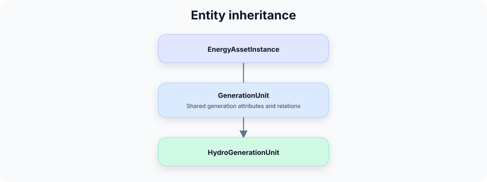

# Schemas

!!! abstract "Before you start"
    - **Prerequisites:** [Core Concepts (EAR)](core-concepts.md)
    - **Lookup:** [CESDM Schema Reference (HTML)](../reference/schema-reference.html) · [Modeller cheat sheet](modeller-cheat-sheet.md)

This page goes **one level deeper on the schema side** of [Core Concepts (EAR)](core-concepts.md). That chapter explains the split between **schemas** (vocabulary and rules) and your **system model** (instances, values, and links). Here the focus is **what lives in the YAML schema files** and how that differs from the data you assign in Python.

!!! quote "Same split as Core Concepts"
    **Schemas** define entity classes and map attributes and relations to those classes.  
    **Your system model** creates instances and assigns values and relation targets — it does not redefine the vocabulary.

---

## Why schemas are separate from the engine

CESDM does **not** hard-code energy concepts into the [EAR](../community/glossary.md#ear) engine. Domain knowledge lives in external **[YAML](../community/glossary.md#yaml) schema** packages; the engine applies generic `add_entity`, `add_attribute`, and `add_relation` against whatever schemas you load.

That separation means:

- the **same engine** can serve different schema packages;
- **validation** checks your assignments against the loaded vocabulary;
- tools and studies can share one **agreed class and attribute naming** without sharing the same Python code.

For the full stack diagram, see [Core Concepts — Schemas, engine, and your model](core-concepts.md#schemas-engine-and-your-model).

---

## What a schema file defines

Schemas answer *what may exist* — not *what exists in your study*.

| Building block | Role in schemas | Example |
|----------------|-----------------|---------|
| [Entity classes](../community/glossary.md#entity-class) | Types modellers can instantiate | `GenerationUnit`, `ElectricalBus` |
| **Attributes** | Named slots mapped to classes — type, unit, constraints | `nominal_power_capacity` on `GenerationUnit` |
| **Relations** | Named links mapped to classes — allowed target types | `atNode` from a unit to a network node |
| **Inheritance** | Genuine *is-a* specialisation | `HydroGenerationUnit` extends `GenerationUnit` |
| **[Attribute groups](../community/glossary.md#attribute-group)** | Optional namespace on attributes and relations (`belongsToGroup`) | `dispatch`, `topology`, `power_flow`, … |

Nothing in a schema is a concrete plant, bus, or profile value. Those belong in your **system model** after you call `add_entity` and assign attributes and relations.

---

## Attribute groups

Large entity classes carry attributes and relations for several modelling perspectives — dispatch, network attachment, power flow, spatial location, and so on. **[Attribute groups](../community/glossary.md#attribute-group)** organise those slots in the schema without splitting one physical asset into multiple entities.

Each attribute or relation may declare `belongsToGroup` in the schema:

```yaml
attributes:
  - id: nominal_power_capacity
    belongsToGroup: dispatch

relations:
  - id: atNode
    belongsToGroup: topology
```

The assignment is **organisational only**. It does not create entities, duplicate data, or change semantics — it records which perspective a slot belongs to and how the [Proxy API](../guides/proxy-api.md) groups properties in Python.

Typical groups shipped with CESDM:

| Group | Purpose |
|-------|---------|
| `dispatch` | Dispatch and operational properties |
| `topology` | Network attachment within a domain (`atNode`, `fromNode`, `toNode`) |
| `power_flow` | Power-flow parameters |
| `technical` | Technology-specific properties |
| `capacity_expansion` | Investment / capacity-expansion lifecycle (commission, retrofit, retirement) |
| `spatial` | Geographic information |
| `dynamics` | Dynamic simulation parameters |

Additional groups may be introduced by application-specific schemas. Attribute groups do **not** modify the [EAR](../community/glossary.md#ear) model: every attribute still belongs to exactly one entity, is defined once, and is stored once.

In Python, the Proxy API exposes groups as nested namespaces — for example `hydro.dispatch.nominal_power_capacity` and `hydro.topology.atNode`. See [Proxy API](../guides/proxy-api.md) for read/write patterns and type safety.

---

## Example: schema, Python model, and YAML export

Three representations of the same hydro plant — **class definition**, **in-memory assignments**, and **exported system store**:

### Schema (YAML)

Defines the **class** and which attributes and relations it may have (`schemas/cesdm/…`):

```yaml
name: HydroGenerationUnit
parents:
  - GenerationUnit
attributes:
  - id: nominal_power_capacity
    belongsToGroup: dispatch
relations:
  - id: atNode
    belongsToGroup: topology
  - id: drawsFromHydraulicStorage
```

### System model (Python)

Creates an **instance** and assigns values and relation targets in memory:

```python
bus = model.add_entity("ElectricalBus", "bus.ch")
hydro = model.add_entity("HydroGenerationUnit", "HydroPlant_CH_01")
hydro.nominal_power_capacity = 1200
hydro.atNode = bus
```

The unit (`MW`) is declared in the schema — you assign the numeric value only.

### System store (YAML export)

After `model.export_yaml("my_study.yaml")`, the **same instance** is written in the **flat export format** — attributes and relations as lists keyed by `id`:

```yaml
HydroGenerationUnit:
  HydroPlant_CH_01:
    attributes:
      - id: nominal_power_capacity
        value: 1200
        unit: MW
    relations:
      - id: atNode
        target_entity_ids:
          - bus.ch
```

This file is your **system model persisted** — not a schema file. Re-import it with `import_yaml()` to reload the instances. (CESDM also supports hierarchical export via `export_yaml_hierarchical()` — see [Modelling Workflow](../guides/modelling-workflow.md) — useful for large models, same underlying data.)

If you assign an attribute or relation that is not declared for that class, validation fails — the schema is the contract.



**Inheritance** expresses genuine *is-a* specialisation (every `HydroGenerationUnit` is a `GenerationUnit`). It is not used just because two assets share a few attributes — see [Schema Augmentation](schemas-in-depth.md) when you need to extend the vocabulary beyond core classes.

---

## Where schemas live

Reference schemas ship under:

```text
schemas/cesdm/
```

Schema file layout (entity classes, global attributes, relations, manifests) is documented in the [CESDM Schema Reference](../reference/schema-reference.md). Modellers typically **load** schemas via `build_model_from_yaml("schemas/cesdm")` and do not edit them.

---

## Schema augmentation

When your study needs attributes or entity classes not defined in CESDM core, compose an **augmentation package** at load time — in schema YAML, without changing core classes or Python engine code. See [Schema Augmentation](schemas-in-depth.md).

---

## When to use this page

| Your goal | Where to go |
|-----------|-------------|
| Look up a class, attribute, or relation | [CESDM Schema Reference](../reference/schema-reference.md) or [Modeller cheat sheet](modeller-cheat-sheet.md) |
| Understand schema vs system model | [Core Concepts (EAR)](core-concepts.md) |
| See what is inside YAML schema files | **This page** |
| Understand attribute groups (`belongsToGroup`) | **This page** — [Attribute groups](#attribute-groups) |
| Extend or compose schemas | [Schema Augmentation](schemas-in-depth.md) |

---

## Next step

**Modellers:** [Validation](validation.md) → [Proxy API](../guides/proxy-api.md) → [Libraries](../guides/libraries.md).

→ [Validation](validation.md) · [← Core Concepts](core-concepts.md) · [Concepts overview](concepts.md)
