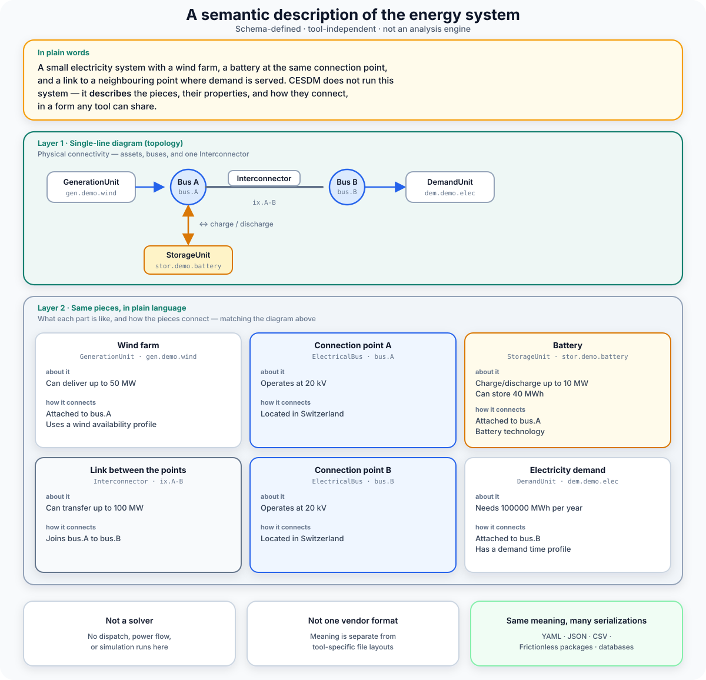
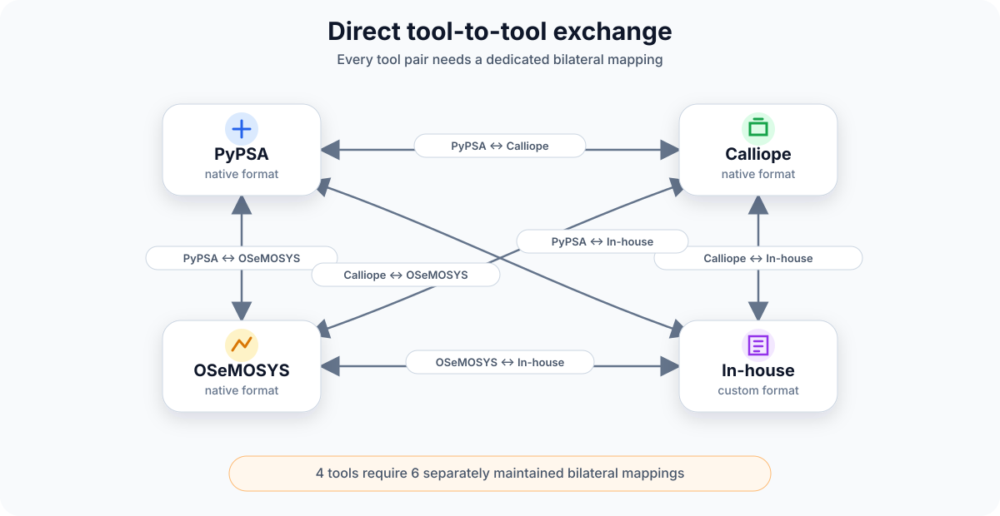

# What is CESDM?

CESDM (**Common Energy System Domain Model**) is a **semantic framework for representing energy systems**.

It provides a common semantic representation of the energy system that is independent of any particular analysis method, software tool, or storage technology.

Rather than describing how individual applications organise or store information, CESDM represents the **system itself** — using a common semantic reference that preserves a consistent understanding of the underlying physical system.

| | |
|---|---|
| **Goal** | One agreed system description so modellers can exchange harmonised data and compare results across tools and studies |
| **Scope** | Physical energy systems — networks, assets, profiles; multi-carrier; schema-defined and validated — **not** a solver or optimiser |

{ width="90%" }

---

## With and without CESDM

Consider a **2030 decarbonisation scenario** for a **European country**: the same transmission network, generators, demand, and renewable profiles. One team builds and runs the case in **PyPSA**[^pypsa], a partner uses **Calliope**[^calliope], a third runs **OSeMOSYS**[^osemosys], and a fourth uses an **in-house framework**. Each tool can analyse that **same country-level system** — but each stores and serialises it in its **own format**.

The problem arises when the teams need to **exchange the scenario**: share the 2030 case with a collaborator, compare results across **PyPSA**, **Calliope**, **OSeMOSYS**, and the in-house model on the same country-level system, or hand it to a partner institution. Without a common layer, that exchange requires direct conversion between every pair of tools — and there is no guarantee the exchanged files still describe the **same physical system**.

### Without CESDM — direct tool-to-tool exchange

{ width="85%" }

Without a common layer, **every pair of tools needs its own import/export mapping**. The PyPSA team cannot pass the scenario straight to the Calliope group — you maintain separate PyPSA↔Calliope, PyPSA↔OSeMOSYS, PyPSA↔in-house, Calliope↔OSeMOSYS, Calliope↔in-house, and OSeMOSYS↔in-house converters, and more for every additional tool.

| Tools | Bilateral mappings to maintain |
|-------|-------------------------------|
| 2 | 1 |
| 4 | 6 |
| 6 | 15 |
| 10 | 45 |

The number grows quadratically: **n tools require n(n−1)/2 mappings**. Each mapping encodes its own assumptions about names, units, and semantics. When a tool is updated or a new partner joins with another framework, several converters for the same 2030 country case may need updating — and nothing guarantees that exchanged models still describe the same physical system.

For the **2030 decarbonisation scenario**, four teams mean **six pairwise converters** — matching the table above for four tools — not one agreed representation of the country's energy system.

### With CESDM — a common exchange layer

{ width="85%" }

For that **same European 2030 scenario**, CESDM sits at the centre as a **common semantic model of the country-level system**. **PyPSA**, **Calliope**, **OSeMOSYS**, and the **in-house framework** each need **one bidirectional mapping** — to and from CESDM — instead of a mapping to every other tool.

| Tools | Mappings to maintain |
|-------|---------------------|
| 4 | 4 |
| 6 | 6 |
| 10 | 10 |

**n tools require n mappings.** Adding a new tool means adding one import/export path, not rewiring every existing pair.

Because CESDM defines the **meaning** of entities, attributes, and relations (via schemas), all tools exchange through the same vocabulary. The 2030 country case is described once; a partner can import it into PyPSA, Calliope, OSeMOSYS, or an in-house workflow through that tool's single CESDM mapping — without negotiating a direct converter to every other tool in the project.

PyPSA, Calliope, OSeMOSYS, and your in-house scripts remain **analysis tools**. CESDM is the **shared exchange layer** they map through.

### One physical system — data for many analyses

CESDM provides a **second major advantage**, distinct from tool exchange: for that **same 2030 country model**, the domain representation can hold the information required for **different types of analysis** — not only passing files between PyPSA, Calliope, OSeMOSYS, and other tools.

A single generator in the country scenario, for example, can carry:

| Analysis perspective | Examples of what stays on the same asset |
|---------------------|------------------------------------------|
| **Dispatch / planning** | Installed capacity, variable costs, availability profiles |
| **Power flow** | Reactive limits, voltage set-points, branch impedances |
| **Dynamic simulation** | Inertia, governor and excitation parameters |

These are not separate models that must be kept in sync manually. They are **different views of the same physical asset** — **analysis-specific attributes** on one CESDM model. The physical topology — buses, lines, carrier domains — is shared; each analysis uses what it needs.

{ width="90%" }

Without CESDM, the 2030 planning case, a power-flow validation, and a dynamic study often become **separate files** in different toolchains — a dispatch dataset here, a power-flow case there, a dynamic model elsewhere — with no guarantee they still describe the same plant or network. With CESDM, you maintain **one semantic description of the same system** and attach **analysis-specific attributes** as needed.

---

## What CESDM holds — and what it does not

The exchange story above shows **how** teams share a scenario. What follows answers **what** CESDM holds, how that differs from **analysis type**, and what still runs in external tools.

### What CESDM describes

For the **same 2030 country scenario**, CESDM is the agreed description of the **physical system** — who is connected to whom, with what assets, profiles, and carriers — not a PyPSA network file or a Calliope run configuration.

| | Examples in a country-level model |
|---|-----------------------------------|
| **Topology** | Networks, assets, demand, storage, conversion technologies |
| **Context** | Carrier domains, geographical structure, time series and profiles |
| **Meaning** | Schema-defined entities, attributes, relations between components |

That is the **one semantic description of the same system** from the multi-analysis section above: the shared physical basis that every tool and every study type refers to.

### Semantics first, analysis type second

CESDM separates **what the system is** from **what kind of study you run on it**.

Planning dispatch, power flow, and dynamic simulation need different input data on the **same assets** — costs and profiles for dispatch, impedances for power flow, machine parameters for dynamics. In CESDM these are not separate models that must be kept in sync; they are **analysis-specific attributes** on one domain model, attached to the same physical assets as each study requires.

| Layer | 2030 scenario example | CESDM's role |
|-------|----------------------|--------------|
| **Semantic system** | Same generators, lines, demand, profiles | **Define once** — shared physical meaning |
| **Analysis type** | Capacity expansion vs operational dispatch vs power-flow validation | **Hold the data** each study needs on the same assets |
| **Study execution** | Optimisation in PyPSA, PF in pandapower | **Outside CESDM** — tools and solvers run the study |

CESDM is also independent of **storage and exchange formats** — whether the model is serialised as [YAML](../community/glossary.md#yaml), JSON, or a [Frictionless Data Package](../community/glossary.md#frictionless-data-package) does not change its meaning. That is a separate concern from analysis type.

### What CESDM stores — and what it never runs

CESDM is a **semantic representation**, not an analysis engine. It does **not** perform optimal dispatch, power flow, market clearing, or dynamic simulation — you still run those studies in PyPSA, Calliope, pandapower[^pandapower], or another solver.

What CESDM **does** provide is a common way to describe both **inputs and outputs** of those studies:

| CESDM can represent | CESDM does not execute |
|---------------------|------------------------|
| The physical energy system (assets, topology, profiles) | Optimal dispatch optimisation |
| Analysis-specific input data (costs, impedances, dynamic parameters) | Power-flow or OPF calculation |
| **Results** of a specific analysis, stored for comparison (flows, voltages, dispatch schedules, …) | Market simulation or clearing |
| Validation, libraries, and tool-independent exchange | Time-stepping or numerical simulation |

The **results** of a study can live in CESDM alongside the same system model — for comparison across runs, tools, or scenarios — but the schedule or power-flow solution must still be **computed** by PyPSA, Calliope, pandapower, or another solver.

You build and validate the 2030 scenario in CESDM, export to the tool that runs your study, and bring the results back when you want to archive, compare across PyPSA, Calliope, OSeMOSYS, and in-house workflows, or share them with partners.

---

## In summary

**CESDM describes the physical energy system; analysis tools run the studies.**

| CESDM is… | CESDM is not… |
|-----------|---------------|
| A **semantic model** of assets, networks, carrier domains, and profiles | An **analysis engine** (no optimisation, power flow, or simulation) |
| A **common exchange layer** — *n* tools, *n* mappings, not *n(n−1)/2* pairwise converters | A **substitute** for PyPSA, Calliope, pandapower, or your solver |
| **One domain model** for many analysis types (dispatch, power flow, dynamics) on the same assets | **Tied to one** vendor format or software ecosystem |
| A place to **store and compare results** alongside the system model | **Only** an input format — results can live in CESDM too, but solvers compute them elsewhere |

**One sentence:** CESDM is the shared semantic layer through which modellers describe a scenario once, exchange it between tools, attach analysis-specific attributes for different studies, and store results for comparison.

---

## Tool references

The analysis tools named in this chapter are independent open-source or in-house projects. When you cite them in academic work, use the references below (not CESDM itself).

| Tool | Project | Reference |
|------|---------|-----------|
| **PyPSA** | [pypsa.org](https://pypsa.org/) | T. Brown, J. Hörsch & D. Schlachtberger (2018). *PyPSA: Python for Power System Analysis.* Journal of Open Research Software, 6(1). [doi:10.5334/jors.188](https://doi.org/10.5334/jors.188) |
| **Calliope** | [callio.pe](https://www.callio.pe/) | S. Pfenninger & B. Pickering (2018). *Calliope: a multi-scale energy systems modelling framework.* Journal of Open Source Software, 3(29), 825. [doi:10.21105/joss.00825](https://doi.org/10.21105/joss.00825) |
| **OSeMOSYS** | [osemosys.org](https://www.osemosys.org/) | M. Howells et al. (2011). *OSeMOSYS: The Open Source Energy Modeling System.* Energy Policy, 39(10), 5850–5870. [doi:10.1016/j.enpol.2011.06.033](https://doi.org/10.1016/j.enpol.2011.06.033) |
| **pandapower** | [pandapower.org](https://www.pandapower.org/) | L. Thurner et al. (2018). *pandapower — An Open-Source Python Tool for Convenient Modeling, Analysis, and Optimization of Electric Power Systems.* IEEE Transactions on Power Systems, 33(6), 6510–6521. [doi:10.1109/TPWRS.2018.2829021](https://doi.org/10.1109/TPWRS.2018.2829021) |

[^pypsa]: T. Brown, J. Hörsch & D. Schlachtberger (2018). *PyPSA: Python for Power System Analysis.* Journal of Open Research Software, 6(1). [doi:10.5334/jors.188](https://doi.org/10.5334/jors.188)
[^calliope]: S. Pfenninger & B. Pickering (2018). *Calliope: a multi-scale energy systems modelling framework.* Journal of Open Source Software, 3(29), 825. [doi:10.21105/joss.00825](https://doi.org/10.21105/joss.00825)
[^osemosys]: M. Howells et al. (2011). *OSeMOSYS: The Open Source Energy Modeling System.* Energy Policy, 39(10), 5850–5870. [doi:10.1016/j.enpol.2011.06.033](https://doi.org/10.1016/j.enpol.2011.06.033)
[^pandapower]: L. Thurner et al. (2018). *pandapower — An Open-Source Python Tool for Convenient Modeling, Analysis, and Optimization of Electric Power Systems.* IEEE Transactions on Power Systems, 33(6), 6510–6521. [doi:10.1109/TPWRS.2018.2829021](https://doi.org/10.1109/TPWRS.2018.2829021)

---

## Next Step

**Energy system modellers:** [Core Concepts](core-concepts.md) (~10 min) — or [Quickstart](quickstart.md) if you prefer to install first.

→ [Concepts overview](concepts.md) · [Core Concepts](core-concepts.md) · [← Learning path](choose-your-path.md)
