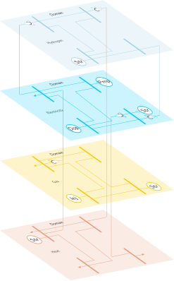
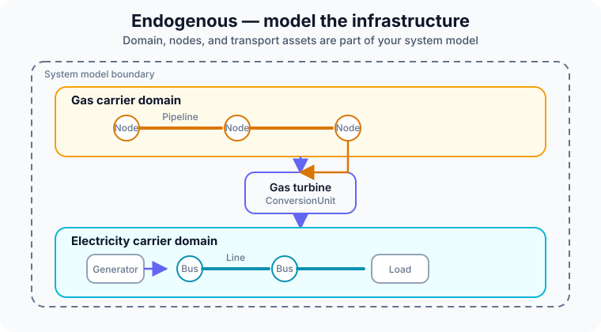
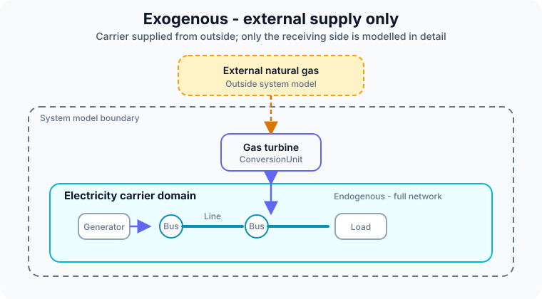

# Carrier Domains

!!! abstract "Before you start"
    - **Prerequisites:** [Core Concepts](../getting-started/core-concepts.md)
    - **Electricity-only first model:** [Your First Model (Simple)](../getting-started/first-model-simple.md)
    - **Multi-carrier build:** [Building your CESDM Model — Part 4](../tutorials/building-first-model/part-4-multicarrier-and-export.md)

A **carrier domain** is the semantic context for one **physical transfer infrastructure** — electricity, gas, heat, hydrogen, and so on. Within a domain, assets transport, inject, withdraw, or store **one carrier**. Domains do not exchange carriers directly; **Conversion Units** (gas turbine, electrolyser, heat pump, …) connect them.

---

## In CESDM

| Concept | Role |
|---------|------|
| `CarrierDomain` | Declares a transfer domain (e.g. `domain.electricity`, `domain.gas`) |
| `belongsToCarrierDomain` | Places a **network node** in that domain (**required**, cardinality 1) |
| **Network nodes** (`ElectricalBus`, `GasBus`, …) | Points where the carrier is injected, withdrawn, or routed |
| **Transport elements** (`TransmissionLine`, …) | Move carrier between nodes via `fromNode` and `toNode` |
| **Single-port assets** (`GenerationUnit`, `DemandUnit`, `StorageUnit`, …) | Inject or withdraw at one node via `atNode` |
| `ConversionUnit` family (`CHPUnit`, `HeatPumpUnit`, `ElectrolyserUnit`, `BoilerUnit`, `FuelCellUnit`, `GenericConversionUnit`, …) | Links **between** domains (one carrier in, another out) |

Your [first model](../getting-started/first-model-simple.md) uses one electricity domain. For the minimal pattern, see that tutorial — this page focuses on **multi-carrier scope and modelling boundaries**.

---

## Between domains: Conversion Units only

Different carrier domains never exchange carriers directly. A physical transformation is always a **Conversion Unit**:

| Process | From | To |
|---------|------|-----|
| Gas turbine | Gas domain (or external gas) | Electricity domain |
| Electrolyser | Electricity | Hydrogen |
| Heat pump | Electricity | Heat |

The conversion unit is the semantic bridge; each domain keeps its own network and balance logic.

For a worked district-hub example with heat pump, electrolyser, boiler, fuel cell, and CHP, see the [Conversion Units tutorial](../tutorials/conversion-units/overview.md).

---

## Endogenous and exogenous domains

Not every carrier needs an explicit network in your study. The choice is **modelling scope**, not physics.

### Endogenous — model the infrastructure

The domain, its nodes, and its assets are part of your system model.

Both gas and electricity infrastructures are represented.

### Exogenous — external supply only

The carrier is supplied from **outside** the model boundary. Only the receiving side (often electricity) is modelled in detail.

Common for **electricity-only** capacity expansion: gas at a CHP or gas turbine is exogenous; the grid is endogenous.

The same plant can be represented either way — the technology is the same; only the **system boundary** changes.

---

## Choosing scope

| Your study | Model gas / heat network? | Typical pattern |
|------------|---------------------------|-----------------|
| Electricity-only capacity expansion | No | Exogenous fuel at gas/CHP units |
| Sector-coupled dispatch | Often yes | Endogenous `CarrierDomain` for gas and heat |
| European scenario (TYNDP-style) | Varies by boundary | Mix: endogenous electricity + exogenous or partial gas |

When in doubt, start **electricity endogenous, other carriers exogenous**, then widen the boundary only when the study needs network detail on that carrier.

---

## Next step

→ [Building your CESDM Model — Part 4](../tutorials/building-first-model/part-4-multicarrier-and-export.md) — gas, heat, and CHP in the reference model  
→ [Proxy API](proxy-api.md) · [Libraries](libraries.md) · [Concepts overview](../getting-started/concepts.md)
