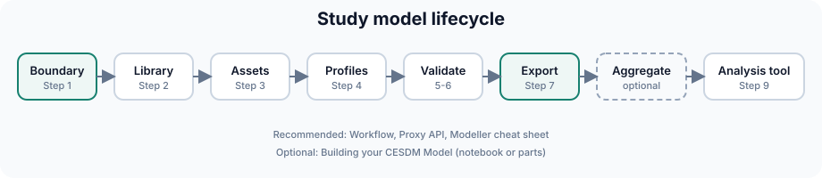

# Modelling Workflow for Energy System Modellers

This page describes the typical lifecycle of a CESDM study model — from first setup to hand-off to an analysis tool. Each step links to the relevant guide.

!!! abstract "Before you start"
    Complete the [Quickstart](../getting-started/quickstart.md) or [Your First Model (Simple)](../getting-started/first-model-simple.md) first so you have seen the full workflow once.

!!! tip "Recommended path"
    Complete **Concepts** first ([Core Concepts](../getting-started/core-concepts.md) → [Schemas](../getting-started/schemas.md) → [Validation](../getting-started/validation.md) → [Proxy API](proxy-api.md) → [Libraries](libraries.md)). Use this page as your build lifecycle. Keep the [Modeller cheat sheet](../getting-started/modeller-cheat-sheet.md) open while you work. Open [Profiles](profiles.md) at Step 4. [Building your CESDM Model](../tutorials/building-first-model/overview.md) is an optional deep dive.

---

## Overview



A CESDM study model moves from scope definition through structural build, time-dependent data, validation, and export to an analysis tool. The table below maps each phase to what you actually do in Python and where to read more.

| Step | Action | What you do | Guide |
|------|--------|-------------|-------|
| 1 | Define system boundary | Create the top-level `EnergySystemModel`, add [carrier domains](carrier-domains.md), and decide which carriers are modelled inside the system vs supplied from outside. | [Core Concepts](../getting-started/core-concepts.md), [Carrier Domains](carrier-domains.md) |
| 2 | Import shared library | Call `import_library()` so carriers, technology types, and other reference entities come from the default library instead of being redefined in every project. | [Libraries](libraries.md) |
| 3 | Add assets | Instantiate buses, generation, demand, storage, and conversion units; set attributes and build in-domain topology (`atNode`, `fromNode`, `toNode`) with Core [EAR](../community/glossary.md#ear) functions or the [Proxy API](../community/glossary.md#proxy-api). | [Core Concepts (EAR)](../getting-started/core-concepts.md), [Proxy API](proxy-api.md) |
| 4 | Attach time series | Add `TimestampSeries` and `Profile` entities in the model; point assets at profiles while numerical arrays live in HDF5 or Parquet. | [Profiles & Time-series](profiles.md) |
| 5 | Schema validation | Run schema checks so every entity, attribute, and relation conforms to the CESDM contract before you share or export. | [Validation — schema](../getting-started/validation.md#schema-validation) |
| 6 | Analysis-specific validation | Check the model is complete for *your* study — required profiles, capacities, and other fields the target analysis expects. | [Validation — analysis-specific](../getting-started/validation.md#analysis-specific-validation) |
| 7 | Export YAML / Frictionless packages | Write the structural model and profile data as a portable package other tools and collaborators can import. | [Part 4](../tutorials/building-first-model/part-4-multicarrier-and-export.md) · [YAML](../community/glossary.md#yaml) · [Frictionless](../community/glossary.md#frictionless-data-package) |
| 8 | Spatial aggregation (optional) | Derive a coarser spatial version of an existing model when the study resolution does not need full detail. | [Spatial Aggregation](spatial-aggregation.md) |
| 9 | Import to analysis tool | Load the exported package into power-flow, market, or other analysis software via adapters in `tools/`. | [Tool exchange](../getting-started/what-is-cesdm.md#with-and-without-cesdm) · `tools/` in repository |

---

## Step 1 — Define the system boundary

Create the top-level container and modelling scope:

```python
from cesdm_toolbox import build_model_from_yaml
from cesdm.default_library import CarrierDomains

model = build_model_from_yaml("schemas/cesdm")
model.import_library("library/default_library")

system = model.add_entity("EnergySystemModel", "MY_STUDY_2030")
system.long_name = "My country study, 2030 scenario"

electricity = model.get_entity(CarrierDomains.DOMAIN_ELECTRICITY)
```

Decide which [Carrier Domains](carrier-domains.md) are **endogenous** (modelled explicitly) vs **exogenous** (external supply only). Electricity-only studies often keep gas exogenous at conversion units. Default domains (`domain.electricity`, `domain.gas`, `domain.heat`, `domain.hydrogen`) come from the library — geography stays on regions/buses via `belongsToGeographicalRegion`.

---

## Step 2 — Import the default library

```python
model.import_library("library/default_library")
```

Import shared reference entities (carriers, domains, technology types, resources) from the default library instead of redefining them. See [Libraries](libraries.md).

---

## Step 3 — Add assets

Use the [Proxy API](proxy-api.md) for day-to-day work:

```python
from cesdm.default_library import CarrierDomains, GeneratorTypes

bus = model.add_entity("ElectricalBus", "bus.ch")
bus.name = "Switzerland 380 kV"
bus.nominal_voltage = (380, "kV")
bus.belongsToCarrierDomain = CarrierDomains.DOMAIN_ELECTRICITY

gen = model.add_entity("GenerationUnit", "gen.ch.wind")
gen.name = "Swiss wind"
gen.nominal_power_capacity = (3500, "MW")
gen.hasTechnology = GeneratorTypes.GENERATION_RENEWABLE_WIND_ONSHORE
gen.atNode = bus
```

See [Common modelling tasks](../getting-started/modeller-cheat-sheet.md) for quick patterns.

---

## Step 4 — Attach profiles

Structural metadata lives in the CESDM model; numerical arrays live in HDF5 or Parquet. See [Profiles & Time-series](profiles.md) for profile types and storage layout.

```python
ts = model.add_entity("TimestampSeries", "ts.main")
ts.start_datetime = "2030-01-01T00:00:00"
ts.resolution = "1h"
ts.length = 8760

profile = model.add_entity("Profile", "profile.demand.ch")
profile.profile_type = "as_normalized_annual_energy"
profile.profile_unit = "MWh"
profile.data_reference = "profiles.h5:/profiles/demand_ch"
profile.hasTimestampSeries = ts

demand = model.get_entity("dem.ch")
demand.hasDemandProfile = profile
```

---

## Step 5 — Schema validation

Checks structural correctness against CESDM schemas. See [Validation — schema validation](../getting-started/validation.md#schema-validation).

```python
errors = model.validate()
if errors:
    for e in errors:
        print(e)
else:
    print("Schema validation passed.")
```

---

## Step 6 — Analysis-specific validation

Checks whether the model contains information required for your study. See [Validation — analysis-specific](../getting-started/validation.md#analysis-specific-validation).

```python
errors = model.validate_for_analysis("optimal_dispatch")
```

Shipped profiles include `optimal_dispatch`, `power_flow`, and `dynamics` under `analysis_profiles/`.

---

## Step 7 — Export

```python
output_dir = "output/my_study"
model.export_yaml_hierarchical(f"{output_dir}/my_study.yaml")
model.export_frictionless(
    f"{output_dir}/frictionless/",
    name="my-study",
    title="My study model",
    include_library="referenced",
)
```

| Format | Best for |
|--------|----------|
| **YAML** ([glossary](../community/glossary.md#yaml)) | Version control, human review, re-import |
| **[Frictionless](../community/glossary.md#frictionless-data-package)** | Tabular exchange, spreadsheets, pipelines |
| **HDF5 profiles** | Large time-series alongside YAML metadata ([glossary](../community/glossary.md#yaml)) |

---

## Step 8 — Spatial aggregation (optional)

Derive a coarser model from a detailed one without rebuilding from scratch. See [Spatial Aggregation](spatial-aggregation.md).

---

## Step 9 — Hand off to analysis tools

Each analysis tool maps once to CESDM rather than to every other tool — see [With and without CESDM](../getting-started/what-is-cesdm.md#with-and-without-cesdm). Import/export utilities for PyPSA, pandapower, MATPOWER, FlexEco, and others live in the repository `tools/` directory. The CESDM model remains the single source of truth; each tool receives a derived view.

---

## Modeller checklist

Before sharing or publishing a model:

- [ ] `EnergySystemModel` and carrier domains defined
- [ ] All assets attached to the transport network (`atNode`, `fromNode`/`toNode`)
- [ ] Technologies referenced from library where appropriate
- [ ] Profiles linked with correct `profile_type` and matching array length
- [ ] `model.validate()` passes
- [ ] `model.validate_for_analysis("<your study>")` passes
- [ ] YAML ([glossary](../community/glossary.md#yaml)) + profile data exported and paths documented

---

## Next step

→ [Profiles & Time-series](profiles.md) · [Modeller cheat sheet](../getting-started/modeller-cheat-sheet.md) · [← Choose your path](../getting-started/choose-your-path.md)
