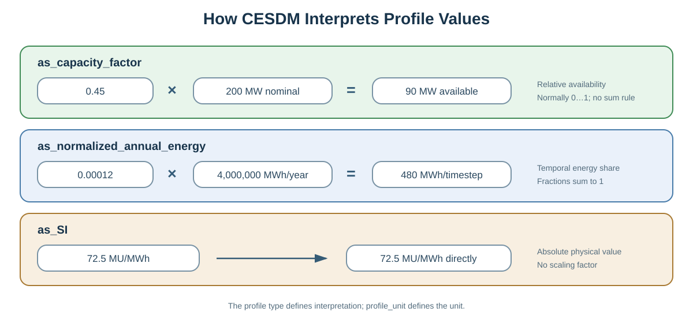

# Profiles and Time Series

!!! abstract "Before you start"
    - **Prerequisites:** [Modelling Workflow](modelling-workflow.md) Step 4, [Your First Model (Simple)](../getting-started/first-model-simple.md), or [Building your CESDM Model — Part 3](../tutorials/building-first-model/part-3-profiles-and-interconnectors.md)
    - **You'll learn:** how time-series metadata lives in CESDM and values live in HDF5/Parquet

CESDM separates the semantic description of time-dependent data from the numerical arrays themselves.

The structural model describes **what a profile represents** and **where it is used**, while the numerical values are stored efficiently in HDF5 or Parquet.



This separation provides several advantages:

- keeps [YAML](../community/glossary.md#yaml) models compact and readable;
- allows multiple profiles to share the same time axis;
- avoids duplication of metadata;
- enables efficient storage and exchange of very large datasets.

---

## Core Concepts

CESDM uses two entities to represent time-dependent data.

| Entity | Purpose |
|---------|---------|
| `[TimestampSeries](../community/glossary.md#timestamp-series)` | Defines the common time axis. |
| `Profile` | Describes the meaning and location of a numerical time series. |

Assets never contain numerical arrays directly.

Instead, they reference a `Profile`, which in turn references a `[TimestampSeries](../community/glossary.md#timestamp-series)`.

```text
Asset
   │
   └── hasAvailabilityProfile
            │
            ▼
        Profile
            │
            └── hasTimestampSeries
                        │
                        ▼
                 TimestampSeries
```

---

## TimestampSeries

A `[TimestampSeries](../community/glossary.md#timestamp-series)` defines the temporal axis shared by one or more profiles.

Typical attributes include:

- `start_datetime`
- `resolution`
- `length`
- `timezone`

Multiple profiles may reference the same `[TimestampSeries](../community/glossary.md#timestamp-series)`, ensuring temporal consistency throughout the model.

---

## Profiles

A `Profile` contains metadata describing how a numerical array should be interpreted.

Typical attributes include:

- `profile_type`
- `profile_unit`
- `data_reference`

The numerical values themselves remain external and are stored in HDF5 or Parquet.

---

## Profile Types

CESDM supports three profile types.

| Profile Type | Meaning | Typical Use |
|--------------|---------|-------------|
| `as_capacity_factor` | Relative availability | Wind, solar, outages |
| `as_normalized_annual_energy` | Distribution of a known annual quantity | Demand, inflows |
| `as_SI` | Absolute physical values | Prices, temperatures, measurements |

### as_capacity_factor

Scales an installed capacity.

```text
available power = capacity factor × installed capacity
```

### as_normalized_annual_energy

Distributes a known annual energy quantity over time.

```text
energy(t) = profile(t) × annual energy
```

### as_SI

Represents absolute physical values without additional scaling.

---

## Linking Profiles

Profiles are connected to assets through semantic relations.

| Relation | Typical Asset |
|----------|---------------|
| `hasAvailabilityProfile` | GenerationUnit |
| `hasDemandProfile` | DemandUnit |
| `hasNaturalInflowProfile` | HydraulicStorageUnit |
| `hasNaturalInflowProfile` | HydroGenerationUnit |

The relation defines the semantic meaning of the profile.

---

## Storage

CESDM separates metadata from numerical values.

```text
CESDM Model
      │
      ├── TimestampSeries
      ├── Profile metadata
      │
      ▼
profiles.h5
    ├── timestamps/
    └── profiles/
```

This keeps the model lightweight while allowing efficient storage of large datasets.

---

## Validation and Best Practices

A valid profile should satisfy:

- supported `profile_type`;
- valid `[TimestampSeries](../community/glossary.md#timestamp-series)`;
- matching array length;
- appropriate units;
- correct scaling information.

Recommended practices:

- reuse `[TimestampSeries](../community/glossary.md#timestamp-series)` whenever possible;
- store large arrays only in HDF5 or Parquet;
- keep profile semantics explicit through relations;
- validate external arrays before analysis.

---

## Summary

CESDM separates structural semantics from numerical data.

- **[TimestampSeries](../community/glossary.md#timestamp-series)** defines the temporal axis.
- **Profiles** describe the meaning of numerical arrays.
- **Profile Types** define how values are interpreted.
- **Semantic relations** connect profiles to assets.
- **HDF5 and Parquet** provide efficient storage for large datasets.

This separation enables scalable, reusable, and tool-independent handling of time-dependent data.

---

## Minimal example

A runnable demo that builds demand, wind/PV capacity-factor, and hydro
inflow profiles (and writes `profiles.h5`) ships as
[`docs/examples/minimal_electricity_model.py`](../examples/minimal_electricity_model.py).

```python
# 1. Shared time axis
ts = model.add_entity("TimestampSeries", "ts.hourly.2030")
ts.start_datetime = "2030-01-01T00:00:00"
ts.resolution = "PT1H"
ts.length = 8760

# 2. Profile metadata (numeric arrays go to HDF5 via export_hdf5)
profile = model.add_entity("Profile", "profile.dem.demo.demand")
profile.profile_type = "as_normalized_annual_energy"
profile.profile_unit = "pu"
profile.data_reference = "profiles.h5:/profiles/profile.dem.demo.demand"
profile.hasTimestampSeries = ts

# 3. Link to asset
dem = model.get_entity("dem.demo")
dem.hasDemandProfile = profile

# 4. Persist arrays
model.export_hdf5("output/minimal_electricity_model/profiles.h5", values_map={
    "profile.dem.demo.demand": demand_pu_array,  # length == ts.length
})
```

The `data_reference` points to the numerical array; the CESDM model stores only metadata and semantics.

---

## Common mistakes

| Mistake | Symptom | Fix |
|---------|---------|-----|
| Array length ≠ `[TimestampSeries](../community/glossary.md#timestamp-series).length` | Validation or export error | Regenerate or trim profile data |
| Wrong `profile_type` | Incorrect scaling in analysis | Match type to physical meaning |
| Missing `data_reference` | Empty profile at export | Set HDF5/Parquet path before export |
| Duplicate time axes | Bloated model | Reuse one `[TimestampSeries](../community/glossary.md#timestamp-series)` for related profiles |

---

## Next step

→ [Validation — analysis-specific](../getting-started/validation.md#analysis-specific-validation) — check profiles and other fields are complete for your study · [← Modelling Workflow](modelling-workflow.md)

