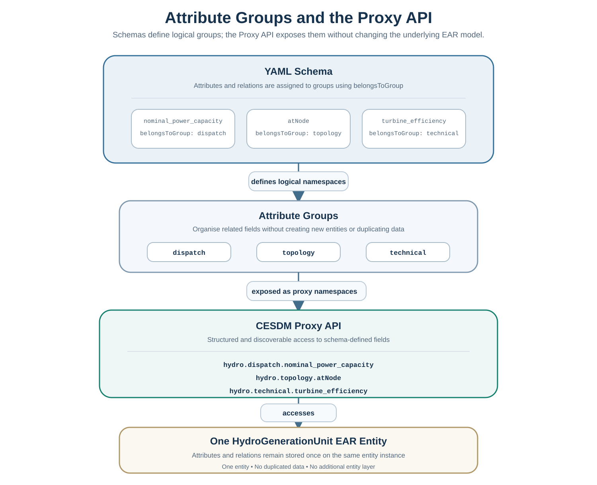

# Object-oriented Proxy API

!!! abstract "Before you start"
    - **Prerequisites:** [Schemas](../getting-started/schemas.md) (attribute groups), [Validation](../getting-started/validation.md), [Quickstart](../getting-started/quickstart.md) or [Your First Model (Simple)](../getting-started/first-model-simple.md), plus [Core Concepts](../getting-started/core-concepts.md)
    - **Recommended for:** energy system modellers building their own study models in Python

## Minimal example

```python
from cesdm_toolbox import build_model_from_yaml
from cesdm.default_library import CarrierDomains, GeneratorTypes

model = build_model_from_yaml("schemas/cesdm")
model.import_library("library/default_library")

electricity = model.get_entity(CarrierDomains.DOMAIN_ELECTRICITY)

bus = model.add_entity("ElectricalBus", "bus.ch")
bus.name = "Switzerland 380 kV"
bus.nominal_voltage = (380, "kV")
bus.belongsToCarrierDomain = electricity

gen = model.add_entity("GenerationUnit", "gen.ch.wind")
gen.name = "Swiss wind"
gen.nominal_power_capacity = (3500, "MW")
gen.hasTechnology = GeneratorTypes.GENERATION_RENEWABLE_WIND_ONSHORE
gen.atNode = bus
```

## Why an Object-oriented Proxy API?

CESDM is fundamentally based on the **Entity–Attribute–Relation ([EAR](../community/glossary.md#ear))** model introduced in the previous chapters.

Every system model is constructed by creating entities and attaching attributes and relations:

```python
hydro.add_attribute(
    attribute_id="nominal_power_capacity",
    value=1200,
    unit="MW",
)

hydro.add_relation(
    relation_id="atNode",
    target_entity_id="bus.ch.vs.380",
)
```

This API is explicit, generic and independent of any particular engineering discipline.

However, large energy system models often contain entities with many attributes and relations describing different aspects of the same physical asset.

The [Proxy API](../community/glossary.md#proxy-api) provides a more convenient object-oriented interface to exactly the same data. Groups such as `dispatch` and `topology` come from the schema — see [Schemas — Attribute groups](../getting-started/schemas.md#attribute-groups).

For example,

```python
hydro.dispatch.nominal_power_capacity = 1200
hydro.topology.atNode = "bus.ch.vs.380"
```

is completely equivalent to the [EAR](../community/glossary.md#ear) representation above.

No additional entities are created.
No information is duplicated.
Both APIs operate on the same underlying CESDM model.

---

## Using attribute groups

[Attribute groups](../community/glossary.md#attribute-group) are declared in schema YAML via `belongsToGroup`. The Proxy API maps them to nested namespaces on each entity — one physical asset, several perspectives:



```python
hydro.dispatch.nominal_power_capacity = 1200
hydro.topology.atNode = bus_vs
```

Full definitions and the list of standard groups: [Schemas — Attribute groups](../getting-started/schemas.md#attribute-groups).

---

## Writing Attributes

The [EAR](../community/glossary.md#ear) API

```python
hydro.add_attribute(
    attribute_id="nominal_power_capacity",
    value=1200,
    unit="MW",
)
```

is equivalent to

```python
hydro.dispatch.nominal_power_capacity = 1200
```

Both statements create exactly the same attribute.

---

## Writing Relations

Likewise,

```python
hydro.add_relation(
    relation_id="atNode",
    target_entity_id="bus.ch.vs.380",
)
```

is equivalent to

```python
hydro.topology.atNode = "bus.ch.vs.380"
```

Again, both APIs modify the same underlying CESDM entity.

---

## Reading Values

Reading follows exactly the same principle.

Using the [Proxy API](../community/glossary.md#proxy-api):

```python
capacity = hydro.dispatch.nominal_power_capacity
node = hydro.topology.atNode
```

or directly through the [EAR](../community/glossary.md#ear) API:

```python
capacity = hydro.get_attr_value(
    "nominal_power_capacity",
    default=0.0,
)

node = hydro.get_relation(
    "atNode"
)

nodes = hydro.get_relations(
    "atNode"
)
```

Both interfaces always access the same stored values.

---

## Type Safety

One of the major advantages of the [Proxy API](../community/glossary.md#proxy-api) is schema-aware type checking.

For example,

```python
hydro.dispatch.nomial_power_capacity = 1200
```

immediately raises

```text
AttributeError

Did you mean:

nominal_power_capacity
```

The suggestion is generated from the CESDM schema rather than a generic spell checker.

Consequently, only valid attributes and relations are suggested.

For typed retrieval of existing entities (`get_entity`, `get_entity_as`), see [Python Typings & Proxies (optional)](python-typing-proxies.md).

---

## Best Practices

For most applications the [Proxy API](../community/glossary.md#proxy-api) is recommended because it

- improves readability;
- provides IDE auto-completion;
- performs schema-aware validation;
- catches typing mistakes immediately.

The [EAR](../community/glossary.md#ear) API remains the underlying canonical representation and is particularly useful for generic tooling, importers, exporters and schema-independent processing.

---

## Summary

CESDM provides two complementary programming interfaces.

The **[EAR](../community/glossary.md#ear) API**

- exposes the underlying Entity–Attribute–Relation model;
- is generic and schema-independent.

The **Object-oriented [Proxy API](../community/glossary.md#proxy-api)**

- presents the same model through typed Python objects;
- exposes [attribute groups](../getting-started/schemas.md#attribute-groups) as nested namespaces;
- improves readability, discoverability and type safety.

Both APIs operate on exactly the same CESDM model and can be used interchangeably.

---

## Next step

→ [Libraries](libraries.md) — import shared reference entities · [Building your CESDM Model](../tutorials/building-first-model/overview.md) · [← Modelling Workflow](modelling-workflow.md)
