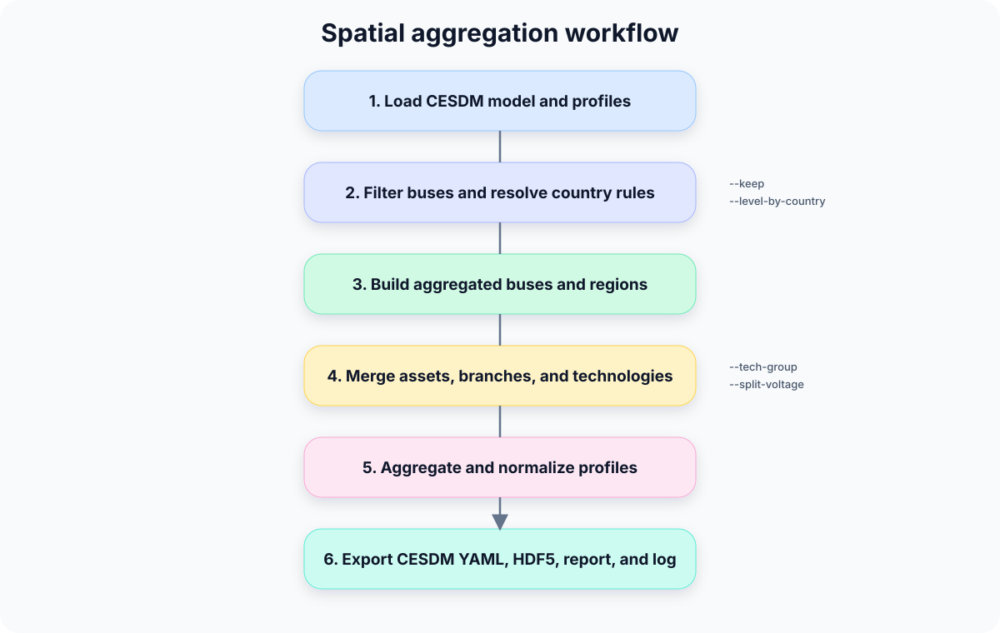

# Spatial Aggregation

!!! abstract "Before you start"
    - **Prerequisites:** A complete detailed CESDM model ([Building your CESDM Model](../tutorials/building-first-model/overview.md) or your own)
    - **You'll learn:** how to derive coarser models for studies that do not need nodal detail

!!! info "Reference model"
    Examples build upon [Building your CESDM Model](../tutorials/building-first-model/overview.md).

## Why Spatial Aggregation?

One of the key ideas behind CESDM is that a single detailed energy system model can support many different analyses.

**Modeller scenario:** You built a nodal TYNDP-style model, but your capacity expansion tool needs country-level regions. Spatial aggregation derives that coarser model without rebuilding from scratch.

However, not every analysis requires the same spatial resolution.

For example:

| Analysis | Typical Spatial Resolution |
|-----------|----------------------------|
| Dynamic Simulation | Original transmission network |
| AC Power Flow | Nodal transmission network |
| Security Analysis | Nodal or NUTS3 |
| Production Cost Modelling | NUTS2 or NUTS1 |
| Capacity Expansion Planning | Country |
| European Scenario Studies | Mixed country resolutions |

Rather than maintaining multiple independent models, CESDM derives smaller analysis-specific models from the common system model.

Spatial aggregation performs this transformation while preserving the CESDM structure.


---

## Aggregation Dimensions

Spatial aggregation combines four independent concepts.

| Dimension | Purpose |
|-----------|---------|
| Spatial Resolution | Merge buses geographically |
| Country-specific Resolution | Different aggregation level per country |
| Technology Aggregation | Merge similar technologies |
| Voltage-level Handling | Keep or merge voltage levels |

These dimensions can be combined freely.

---

## Location Determination: Bus Coordinates First

Spatial aggregation does **not** invent geography. It starts from the
coordinates already stored on network buses in the detailed CESDM model.

### Starting point: bus coordinates

Each electrical bus (and other network nodes) should carry:

| Attribute / relation | Role |
|----------------------|------|
| `latitude`, `longitude` | Geographic position of the bus |
| `belongsToGeographicalRegion` | Link to a `GeographicalRegion` (country or NUTS region from `library/regions_library`), once resolved |
| `belongsToMarketZone` | Optional link to a `MarketZone` (bidding zone) for zonal studies |

Those coordinates are the **anchor** for every spatial decision that follows.
Assets (generation, demand, storage, …) inherit location indirectly through
topology (`atNode`, `fromNode` / `toNode`): they move with the bus they are
connected to.

### From coordinates to countries and NUTS regions

With bus coordinates available, the model (or the importer that built it) maps
each bus into administrative geography:

```text
Bus (lat, lon)
    → point-in-polygon against a NUTS shapefile (optional at import)
    → NUTS3 region
    → NUTS2 / NUTS1 (by code truncation)
    → country (ISO-2 prefix of the NUTS code)
```

Typical sources of that mapping:

- **Importer + shapefile** — for example PyPSA import with
  `--nuts-shapefile` looks up each bus `(longitude, latitude)` in a NUTS
  layer and writes `belongsToGeographicalRegion` (and related region entities).
- **Already annotated model** — buses already have `belongsToGeographicalRegion` pointing at
  `nuts3.*` or country `GeographicalRegion` entities (as in the tutorial
  reference model).
- **Id convention fallback** — if needed, aggregation can also read a NUTS3
  token from structured bus ids such as `node.<nuts3>.<kv>`.

Once a bus is assigned a NUTS3 (or country) code, aggregation levels are just
coarser cuts of the same hierarchy:

| Level | How the bus region is derived |
|-------|-------------------------------|
| `disaggregated` | Keep the original bus (no spatial merge) |
| `nuts3` | Use the bus's NUTS3 region |
| `nuts2` | Truncate NUTS3 → NUTS2 |
| `nuts1` | Truncate NUTS3 → NUTS1 |
| `country` | Use the country of the NUTS3 / region |

So: **coordinates locate the bus → NUTS/country classify the bus →
`--level` chooses how coarsely buses that share that class are merged.**

### What aggregation does with that location

1. Resolve each kept bus to a region key (NUTS3 / NUTS2 / NUTS1 / country),
   using the rules above and any `--level-by-country` overrides. Level
   `disaggregated` skips region merging and keeps the original bus id.
2. Merge all buses that share the same region key (and, optionally, the same
   voltage band if `--split-voltage` is set) into one aggregated bus.
3. Place the aggregated bus at a representative coordinate — typically the
   mean latitude/longitude of its member buses — and attach the appropriate
   `belongsToGeographicalRegion` region.
4. Re-home connected assets and branches onto those aggregated buses.

Without usable bus coordinates (or an equivalent `belongsToGeographicalRegion` / NUTS
annotation derived from them), spatial aggregation cannot reliably assign
buses to countries or NUTS regions.

---

## Configuring Aggregation

The global aggregation level is defined by:

```bash
--level nuts2
```

Supported levels are:

| Level | Description |
|---------|-------------|
| disaggregated | Original buses |
| nuts3 | Aggregate by NUTS3 |
| nuts2 | Aggregate by NUTS2 |
| nuts1 | Aggregate by NUTS1 |
| country | Aggregate by country |

The aggregation level can be overridden for individual countries.

```bash
--level country \
--level-by-country CH=nuts3 DE=nuts1 FR=nuts1
```

This creates hybrid models where Switzerland remains detailed while neighbouring countries are represented more coarsely.

`disaggregated` is true bus passthrough (every original bus kept), not a synonym for `nuts3`. Use it per country when you want full topology in one country and coarser nodes elsewhere:

```bash
--level country \
--level-by-country CH=disaggregated DE=nuts1
```

Two Swiss buses that share the same NUTS3 stay separate under `CH=disaggregated`; under `CH=nuts3` they merge into one node.

---

## Geographic Filtering

Only selected countries or NUTS regions can be retained.

```bash
--keep CH DE FR
```

or

```bash
--keep CH fr042
```

Branches whose endpoints lie outside the selected region are removed automatically.

---

## Voltage Levels

Voltage levels can either be preserved

```bash
--split-voltage
```

or merged

```bash
--no-split-voltage
```

depending on the intended analysis.

---

## Technology Aggregation

Technology aggregation is independent from spatial aggregation.

Matching `hasTechnology` ids are merged with explicit group patterns:

```text
Generation.Thermal.Gas.CCGT.New
Generation.Thermal.Gas.OCGT
          --tech-group 'Generation.Thermal.Gas.*'
                ↓
        Generation.Thermal.Gas   →  one generator per aggregated bus
```

```bash
--tech-group 'Generation.Thermal.Gas.*' \
--tech-group 'Generation.Renewable.Wind.*'
```

Unmatched technologies stay separate. Bare prefixes
(`Generation.Thermal.Gas`) also match subtypes. When several patterns
match, the longest wins. PHS and plain hydro never merge even under a
broad `Generation.Renewable.Hydro.*` group.

---

## How Aggregation Works

Spatial aggregation rebuilds a new CESDM model rather than modifying the existing one.

The workflow consists of:

1. Load the CESDM model (and optional profiles).
2. Read bus coordinates and resolve each bus to a NUTS / country region
   (via `belongsToGeographicalRegion`, shapefile-backed import metadata, or id fallback).
3. Select the retained geographic region (`--keep`).
4. Determine the aggregation level for each country (`--level`,
   `--level-by-country`).
5. Create aggregated buses (merge by region key; optional voltage split).
6. Reassign connected assets from detailed buses to aggregated buses.
7. Aggregate generation, demand and storage (and technologies).
8. Rebuild network topology between aggregated buses.
9. Aggregate profiles.
10. Validate the resulting CESDM model.
11. Export the aggregated model.



---

## Asset-specific Aggregation

Different asset classes require different aggregation rules.

| Asset | Typical Aggregation |
|--------|---------------------|
| Demand | Sum demand, weighted demand profile |
| Generation | Sum capacities, weighted efficiencies and costs |
| Storage | Sum capacities, weighted efficiencies |
| Reservoirs | Preserve reservoir–generator relations |
| Transmission Lines | Keep each circuit as-is; only remap endpoints to aggregated buses |
| Interconnectors | Keep each link as-is; only remap endpoints |
| HVDC Links | Keep each link as-is; only remap endpoints |
| Transformers | Keep each unit as-is; only remap endpoints |

Time-series profiles are aggregated consistently and new CESDM Profile entities are generated automatically.

---

## Running Spatial Aggregation

A typical aggregation is executed as:

```bash
python tools/aggregate_cesdm_model.py \
    --schemas schemas/cesdm \
    --yaml model.yaml \
    --h5 profiles.h5 \
    --outdir results \
    --level country \
    --level-by-country CH=nuts3 DE=nuts1 \
    --keep CH DE FR IT AT \
    --split-voltage
```

The tool produces:

```text
cesdm/

    yaml/

    profiles/

    frictionless/

aggregation_log.txt

subset_summary.txt
```

The output remains a valid CESDM model.

---

## Typical Workflows

### Country Planning

```bash
--level country
```

### Detailed Switzerland

Keep every original Swiss bus (no spatial merge), aggregate other countries:

```bash
--level country \
--level-by-country CH=disaggregated
```

Or merge Switzerland only to NUTS3 while neighbours stay at country level:

```bash
--level country \
--level-by-country CH=nuts3
```

### Structural Aggregation Only

```bash
--no-profiles
```

### Technology Reduction

```bash
--tech-group 'Generation.Thermal.Gas.*' \
--tech-group 'Generation.Renewable.Wind.*'
```

---

## Design Principles

Spatial aggregation follows several important principles.

- The original CESDM model is never modified.
- A new CESDM model is generated.
- All semantic relations are preserved.
- Time-series remain semantically consistent.
- The result is again a valid CESDM model.
- Multiple aggregated models can be derived from the same source model.

---

## Limitations

Spatial aggregation is a model reduction technique.

Consequently,

- internal congestion disappears,
- internal branches are removed (both ends map to the same aggregated bus),
- branch electrical / transfer parameters are not re-estimated (kept as in the source),
- results depend on the quality of the original model.

---

## Summary

Spatial aggregation derives smaller analysis-specific CESDM models from one common detailed system model.

Different combinations of

- spatial resolution,
- technology resolution,
- voltage handling,
- and geographic filtering

allow the same physical energy system to be represented at the level of detail required by each analysis while preserving a consistent CESDM representation.

---

## When not to use spatial aggregation

- Your study **requires nodal detail** (AC power flow, contingency analysis on specific lines).
- You need **internal congestion** within a region — aggregation removes it.
- Buses lack **coordinates** (and have no usable `belongsToGeographicalRegion` / NUTS annotation),
  so country and NUTS mappings cannot be determined.


---

## Next step

→ [Modeller cheat sheet](../getting-started/modeller-cheat-sheet.md) · [← Modelling Workflow](modelling-workflow.md)
