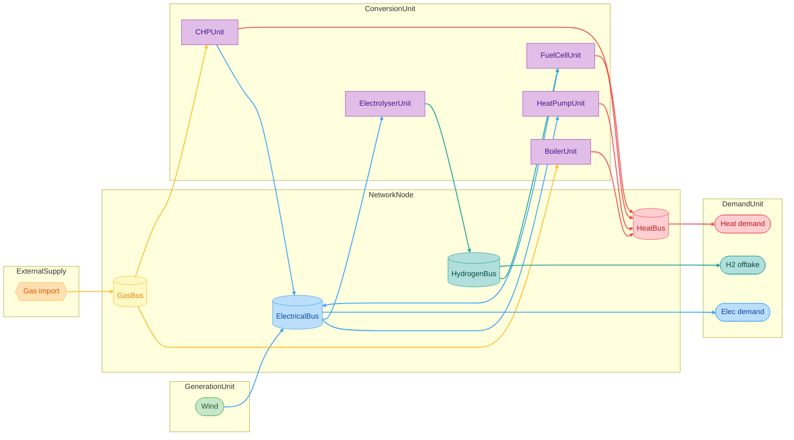

# Conversion Units Tutorial

!!! abstract "Before you start"
    - **Prerequisites:** [Your First Model (Simple)](../../getting-started/first-model-simple.md), [Carrier Domains](../../guides/carrier-domains.md), [Libraries](../../guides/libraries.md)
    - **Time:** ~30–40 minutes across four parts
    - **Audience:** modellers coupling electricity, gas, heat, and hydrogen

This tutorial builds a **Swiss district energy hub** that links four carrier domains through the compact [`ConversionUnit`](../../community/glossary.md#conversion-unit) leaves:

| Leaf | Conversion |
|------|------------|
| `HeatPumpUnit` | electricity → heat |
| `ElectrolyserUnit` | electricity → hydrogen |
| `BoilerUnit` | gas → heat |
| `FuelCellUnit` | hydrogen → electricity (+ optional heat) |
| `CHPUnit` | gas → electricity + heat |

`GenericConversionUnit` + `ConversionPort` remains the escape hatch for arbitrary MxN / P2X layouts — this tutorial stays on the compact leaves.

## Model blueprint



| Part | What you build |
|------|----------------|
| [Part 1](part-1-system-and-carriers.md) | Schema, libraries, system, four domains, four buses |
| [Part 2](part-2-supply-and-demand.md) | Wind, gas import, electricity / heat / H₂ demands |
| [Part 3](part-3-conversion-units.md) | All five compact conversion leaves |
| [Part 4](part-4-validate-and-export.md) | Validate and export |

## Executable script

The same model as a single script:

```bash
python examples/example_conversion_units.py
```

Outputs land under `output/conversion_units_demo/`.
